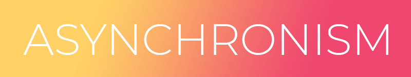
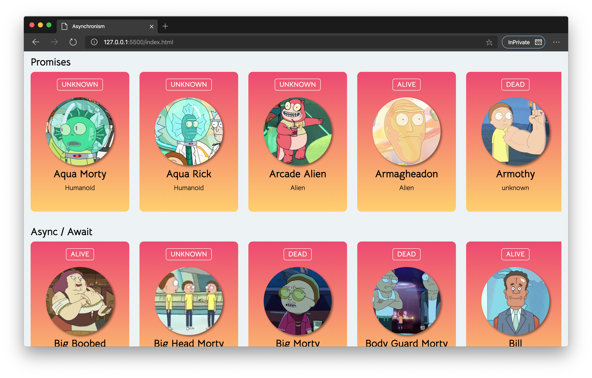

<!-- PROJECT LOGO -->
 

  

  <h3 align="center">Asynchronism</h3>

  

    Consuming an API with Callbacks, Fetch and Async Await.
     
     
    <a href="https://filisantillan.github.io/asynchronism/" target="_blank" rel="noopener">View Demo</a>
    ·
    <a href="https://github.com/FiliSantillan/asynchronism/issues">Report Bug</a>
  

## 🤓 Aprende algo nuevo hoy

> Comparto los **bits** al menos una vez por semana.

Instagram: [@fili.santillan](https://www.instagram.com/fili.santillan/)  
Twitter: [@FiliSantillan](https://twitter.com/FiliSantillan)  
Facebook: [Fili Santillán](https://www.facebook.com/FiliSantillan96/)  
Sitio web: http://filisantillan.com

## ❤ Contenido

## ✨  Comparte

Eres bienvenido a descargar y compartir mis bits. Sería increíble llegar a más personas y compartir conocimiento. Solo te pido que no edites las imágenes o quites mi nombre. Muchas imágenes incluso no tienen mis datos, para que sean más cómodas de leer, por lo que agradecería mucho una mención 😇 .

## 🤜 Contribuye

Cualquier contribución es bienvenida, si crees que podrías tener un tema interesante para crear un **bit**, puedes crear un [issue](https://github.com/FiliSantillan/Bits/issues). También puedes mandar un PR para correcciones de ortografía, typos o mejoras. 

## 📚 Recursos

En cada **Bit** vas a ver los recursos que utilize para la creación del mismo. Aunque quisiera hacer algunas menciones generales que me ayudaron a lograr este tipo de contenido.

- [Samantha Ming](https://www.instagram.com/samanthaming/): Aunque ya compartía este contenido desde hace tiempo en mis redes sociales, sus **tidbits** fueron de gran inspiración para darles forma a mis bits.
- Las portadas y finales usan iconos de Freepik: https://www.flaticon.es/autores/freepik

## 📜 Licencia

Este trabajo esta bajo una licencia [CC BY-NC-ND 4.0](https://creativecommons.org/licenses/by-nc-nd/4.0/deed.es).

Siempre es bueno compartir conocimiento, por cual agradezco mucho el hecho de que quieras compartir mi trabajo. En cuanto a las atribuciones, solo no edites las imágenes, estas ya cuentan con mi nombre, pero, si quieres compartir algo que no tenga mi nombre, agradecería mucho que me hagas una mención en cualquiera de mis [redes sociales](#aprende-algo-nuevo-hoy) para así llegar a más gente 😃 .

